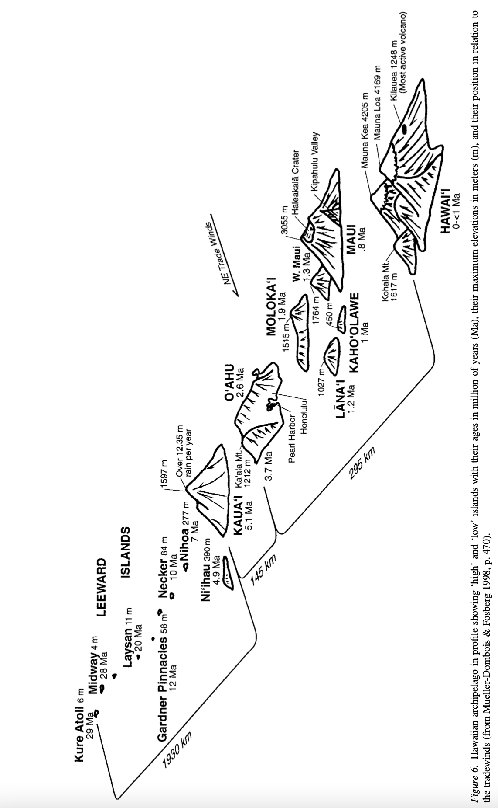

# Homework assignment 2: molecular dating

For this homework assignment we will use a Hawaiian silversword alliance dataset that is also used in a [Landis et al. RevBayes tutorial](https://revbayes.github.io/tutorials/biogeo/biogeo_epoch.html). However, instead of using a Bayesian molecular dating approach, we will use two maximum likelihood approaches and compare the results between those and the Bayesian approach of Landis et al.


## Homework assignment 2 REPORT:

Use a scientific writing style. The homework report will follow the template of a short research publication: be brief and specific! Re-read your sentences to look for optimization. The report must not exceed two (2) pages with 11pt font or larger, EXCLUDING figures. Append figures after the text. Deadline to turn in is indicated in the syllabus. START EARLY with the analyses to allow time for troubleshooting, and sufficient time to ultimately write the report.

- Title, author, date
- An introduction section explaining the overlap and/or differences between a maximum likelihood approach to molecular dating and a Bayesian approach (Hint: which one is/can be more elaborate?)
- A methods section explaining the analyses parameters you used and why they are appropriate. Use the format of: "I ran analysis X to Y", e.g., "I ran a bootstrap analysis for 20,000 generations to calculate branch support". Mention the versions of the software you used (hint: look for these in the log files).
- A results and discussion section. Present the different trees that resulted from the analyses as human-readable figures. Are the trees different (are the same groups supported as monophyletic?) between your IQ-Tree results, and those in the RevBayes tutorial? What could cause those differences? (Hint: look at the alignment; what type of gene was used, and think about how gaps are treated between likelihood and Bayesian tree inference methods). Are your dating results the same between both dating approaches, and the same as the RevBayes tutorial results? If not, how are they different? Would this lead to different conclusions? Are these results reliable? Can you identify any weaknesses in the models?
- Numbered figures of the resulting trees from your analyses, referenced in the text, and a screenshot of your calibrations.txt file


## 1. Infer a ML tree with IQ-Tree

1. Infer a ML tree with IQ-Tree, as you have done for homework assignment 1. The input alignment file is available in the Homework2 folder on the Mana cluster, called ```silversword.mol.nex```. Prepare a folder with a slurm script (modify from Homework1) that will instruct IQ-Tree to infer a maximum likelihood tree. Your IQ-Tree command can look like:

```
iqtree -s silversword.mol.nex -runs 10 -bb 1000 -nt AUTO
```

2. After this tree inference analysis finishes, transfer the resulting files back to your local computer. Include relevant details from the log file (e.g., the selected substitution model) to your report.

## 2. Create two trees

Open the ```.contree``` file with FigTree and root the tree that IQ-Tree generated; the outgroups are <i>Carlquistia_muirii</i> + <i>Anisocarpus_dioides</i> + <i>Anisocarpus_scabridus</i>, which together form a monophyletic group (tarweeds). Save this tree in newick file format using the option 'File > Export Trees...' and tick the box with 'Save as currently displayed'. To create the second tree, select only the ingroup, copy (ctrl+c), open a new FigTree instance (ctrl+n) and paste (ctrl+v) - you will now have a tree of just the ingroup. Save this tree as a separate newick tree file with a sensible name.

## 3. Date the tree with IQ-Tree Least Square Dating using a root calibration.

Members of the silversword alliance are only known from Kauai, Oahu, Maui nui and Hawaii; thus a possible assumption for a molecular clock model is that the most recent common ancestor (mrca) of this group is not older than Kauai. We can reflect this in the molecular dating analysis by setting the ```--date-root``` to ```-5.1``` (representing 5.1 Ma ago). Make a new folder where you place two input files: the tree without the outgroup, the alignment file (where you have removed the outgroup taxa) and prepare a slurm script that will start the following IQ-Tree analysis:

```
iqtree -s YOURALN_FILE -te YOURTREE_FILE --date-root -5.1 --date-tip 0 --date-ci 100
```

Use the IQ-Tree command reference to explain these parameters in your homework report. Transfer the folder with the input files to the Mana cluster and add the run to the queue. After it finishes, transfer all files back to your local computer and examine the resulting tree in FigTree, and create a tree figure for the report that includes confidence interval node bars, node ages (text) and a labeled x-axis that reflects time.


## 4. Date the tree with IQ-Tree Least Square Dating using mrca clade calibration.

For this analysis you will use the tree with the outgroups included. Some of the silversword alliance internal groups in the tree have further restricted distributions (island endemicity), which we can use to set assumptions on their maximum clade age. For this, we will set most recent common ancestor (mrca) minimum ages, where the clades that are endemic to an island cannot be older than that island. Because this is a small dataset, we still have to constrain the mrca age of the silversword alliance to 5.1 Ma - if we leave this out the LSD analysis will throw an error: ```There's not enough signal in the input temporal constraints to have unique solution.```. To set mrca calibration pionts, we have to create a calibrations.txt file in the format of:


```
taxon1,taxon2        -50
taxon3,taxon4,taxon5 -100:-110
```


Where in this example the mrca of taxon1 and taxon2 is 50 Ma old (exactly) and the mrca of taxon3, taxon4 and taxon5 is between 100 and 110 Ma old. Note that you cannot put spaces between the taxon names, only commas. The space is used to separate the age from the clade description. You do not have to list all the members of a clade, it can be a subset where IQ-Tree will automatically determine the mrca of that combination.

An example start of your calibrations.txt file can be:

```
Dubautia_knudsenii_subsp._knudsenii,Dubautia_sherffiana -5.1
Dubautia_sherffiana,Dubautia_herbstobatae 0:-3.7
```

Where the first line specifies the ingroup root age, and the second line sets the age of a clade to a maximum of 3.7 Ma, to reflect the age of Oahu. Add calibrations for the following taxa:

The clade with <i>Dubautia_ciliolata_subsp._glutinosa</i> + <i>Dubautia_ciliolata_subsp._ciliolata</i> + <i>Dubautia_arborea</i> and <i>Dubautia_linearis_subsp._hillebrandii</i> is endemic to Hawaii. The clade with <i>Dubautia_platyphylla</i> + <i>Dubautia_menziesii</i> and <i>Dubautia_reticulata</i> is endemic to Maui. The mrca of the clade that includes <i>Dubautia_knudsenii_subsp._knudsenii</i> + <i>Dubautia_laevigata</i> is endemic to Kauai. <i>Dubautia_plantaginea_subps._plantaginea</i> and <i>Dubautia_plantaginea_subsp._magnifolia</i> are endemic to Maui. You can open the alignment in a text editor to reference the exact name of the taxon. You can use this map as a reference for the island ages:



Prepare a slurm script that will run IQ-Tree Least Square Dating with your calibrations.txt file:

```
iqtree -s ALN_FILE --date calibrations.txt -te TREE_FILE --date-tip 0 --date-ci 100
```

Transfer the folder with these input files to the Mana cluster and add your run to the queue. After it finished, transfer the files back to your local computer and use FigTree to make a tree figure with confidence interval node bars, node ages (text) and a labeled x-axis that reflects time.
