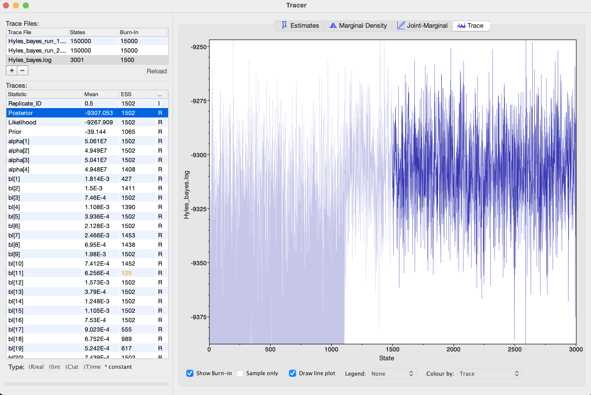

# Homework assignment 3: Bayesian inference phylogenetics

DUE November 20

For this homework assignment we will continue use the Syndemis dataset we aligned and analyzed in homework 1 and 2 to infer BI phylogenies.

## Homework assignment 3 REPORT:

Use a scientific writing style, the homework report will follow the template of a short research publication. Some quick tips to enhance your scientific writing: https://www.scitechedit.com/en-gb/helpful-resources/newsletters/502-improve-your-scientific-writing .

The report must not exceed two (2) pages with 11pt font or larger, EXCLUDING figures. Append figures after the text. Deadline to turn in is indicated in the syllabus. START EARLY with the analyses to allow time for troubleshooting, and sufficient time to ultimately write the report.

- Title, author, date
- An introduction section explaining the differences between the Maximum Likelihood and Bayesian Inference approaches.
- A methods section explaining the analyses parameters used for Bayesian phylogenetic analysis (MCMC and Models of evolution) you used and why they are appropriate. Use the format of: "I ran analysis X to Y", e.g., "I ran a MCMC  for 20,000 generations to calculate branch support". Mention the versions of the software you used (hint: look for these in the log and Rev Script files).
- A results and discussion section. Present the summarized BI tree that resulted from the analyses as human-readable figures. Is the Bayesian tree different from the ML tree in homework 2 (are the same groups supported as monophyletic? what are the differences between bootstrap support and posterior probability support). What could cause those differences?
- Did the MCMC run well? how do you know? Make figures from tracer showing runs. 
- Numbered figures of the resulting trees from your analyses, referenced in the text.


#EXAMPLE WITH THE HYLES DATASET
I will show you how to do thess analyses using the Hyles dataset but use the Syndemis dataset for the homework


## 1. Infer a BI tree with Revbayes
Revbayes website has really good tutorial for many of the analyses. We will conduct partition Bayesian analyses from the website (https://revbayes.github.io/tutorials/partition/)

First we need to make a new environment and install revbayes. We will also use AMAS for this homework so we can install that too

from the command line use these commands
```
#start an interactive session
srun -I30 -p sandbox -N 1 -c 1 --mem=6G -t 0-04:00:00 --pty /bin/bash

#load anaconda
module load lang/Anaconda3/2023.03-1

#create revbayes environment containg the programs revbayes and amas
conda create -n revbayes -c conda-forge -c bioconda libgcc-ng revbayes amas 

```


Next we will need to split the concatenated Hyles dataset using AMAS and convert it to Nexus format. 

In the Homework three folder I will have the Syndemis dataset. Transfer the files to the koa_scratch folder and make a new directory called Revbayes

```
Syndemis_all.fasta
Syndemis_all_part.txt
```

Using this command in amas will split the dataset by loci. 

```
AMAS.py split -f fasta -d dna -i Hyles_all_nc.fasta -l Hyles_all_part.txt -u nexus
```

After splitting the dataset we will have separate genes nexus files. 
```
Hyles_all_Mrbayes_Cad.nex
Hyles_all_Mrbayes_EF1a.nex
Hyles_all_Mrbayes_Wingless.nex
Hyles_all_Mrbayes_mtDNA.nex
```

From the revbayes folder your just made, make a new directory called ```data``` and move the nexus files to this directory

```
mkdir data

mv Hyles_all*.nex data/
```

Next we will need to modify Hyles_revbayes_GTR.rev file from the tutorial for the Syndemis dataset.
Revbayes uses syntax similar to R and python so this may look familiar to some.

Hyles_revbayes_GTR.rev
```
################################################################################
#
# RevBayes Example: Bayesian inference of phylogeny using a GTR+Gamma+Inv
#                   substitution model for a 2-gene partition model
#                   Modified for Hyles genes
# authors: Michael Landis, Sebastian Hoehna, Tracy A. Heath and Brian R. Moore
# modified by: Michael San Jose
#
################################################################################


#######################
# Reading in the Data #
#######################

# read in the character data 
### you will need to change this to match the data your dataset
filenames <- v("data/Hyles_all_Mrbayes_Cad.nex", "data/Hyles_all_Mrbayes_EF1a.nex", "data/Hyles_all_Mrbayes_Wingless.nex", "data/Hyles_all_Mrbayes_mtDNA.nex")

n_data_subsets <- filenames.size()
for (i in 1:n_data_subsets) {
    data[i] = readDiscreteCharacterData(filenames[i])
    num_sites[i] = data[i].nchar()
}

# Get some useful variables from the data. We need these later on.
n_taxa <- data[1].ntaxa()
n_branches <- 2 * n_taxa - 3
taxa <- data[1].taxa()


# Create some vector for the moves and monitors of this analysis
# this setup revbayes MCMC
moves    = VectorMoves()
monitors = VectorMonitors()

##################################
#      Substitution Model        #
#   Loop over each data subset   #
#    GTR model for each gene     #
##################################

####################################################################
## alternatively you can specify a different model for each gene   #
##        you check the tutorial online for details                #
####################################################################
for (i in 1:n_data_subsets) {

    # exchangeability rates for partition i
    er_prior[i] <- v(1,1,1,1,1,1)
    er[i] ~ dnDirichlet(er_prior[i])
    moves.append( mvSimplexElementScale(er[i], alpha=10, tune=true, weight=3) )

    # stationary frequencies for partition i
    pi_prior[i] <- v(1,1,1,1)
    pi[i] ~ dnDirichlet(pi_prior[i])
    moves.append( mvSimplexElementScale(pi[i], alpha=10, tune=true, weight=2) )

    # rate matrix for partition i
    # setup a GTR MODEL
    Q[i] := fnGTR(er[i],pi[i]) 
  
    # +Gamma for partition i
    alpha[i] ~ dnUniform(0, 1E8)
    gamma_rates[i] := fnDiscretizeGamma( alpha[i], alpha[i], 4, false )

    # add moves for the alpha parameter
    moves.append( mvScale(alpha[i],weight=2) )

    # the probability of a site being invariable
    pinvar[i] ~ dnBeta(1,1)
    moves.append( mvBetaProbability(pinvar[i], delta=10, tune=true, weight=2.0) )

}


##############
# Tree model #
##############

# you will need to set up outgroup for the dataset
# for the syndemis dataset it will be jd4556_Dichelia_historionana
out_group = clade("ms1512_Galii_AK")
# Prior distribution on the tree topology
topology ~ dnUniformTopology(taxa, outgroup=out_group)
moves.append( mvNNI(topology, weight=n_taxa/2.0) )
moves.append( mvSPR(topology, weight=n_taxa/10.0) )

# Branch length prior
for (i in 1:n_branches) {
    bl[i] ~ dnExponential(10.0)
    moves.append( mvScale(bl[i]) )
}

TL := sum(bl)

psi := treeAssembly(topology, bl)


##############################
# Partition rate multipliers #
##############################

# specify a rate multiplier for each partition
part_rate_mult ~ dnDirichlet( rep(10.0, n_data_subsets) )
moves.append( mvBetaSimplex(part_rate_mult, alpha=1.0, tune=true, weight=n_data_subsets) )
moves.append( mvDirichletSimplex(part_rate_mult, alpha=1.0, tune=true, weight=2.0) )

# Note that here we are dividing two vectors element-wise, i.e., 
# each element of part_rate_mult gets divided by the corresponding
# element of num_sites. Then we multiply the result by sum(num_sites),
# which is just a scalar. This operation ensures that the mean of
# partition-specific branch lengths, weighted by the number of sites
# in each partition, stays equal to the branch lengths we are 
# actually sampling.

part_rate := part_rate_mult / num_sites * sum(num_sites)


################################
# PhyloCTMC Model              #
# Continuous time markov chain #
################################


for (i in 1:n_data_subsets) {
    phyloSeq[i] ~ dnPhyloCTMC(tree=psi, Q=Q[i], branchRates=part_rate[i], siteRates=gamma_rates[i], pInv=pinvar[i], type="DNA")
    phyloSeq[i].clamp(data[i])
}
############
# Analysis #
############
mymodel = model(psi)
# add monitors

#### changing these monitors will affect your MCMC (How many generations between collection a sample) if your MCMC runs poorly try modifing these values may help. 
#### 
monitors.append( mnModel(filename="output/Hyles_bayes.log",printgen=100) )
monitors.append( mnFile(psi, filename="output/Hyles_bayes.trees", printgen=100) )
monitors.append( mnScreen(TL, printgen=500) )

# run the analysis
#### changing the MCMC parameters will affect also affect your MCMC (How many generations total it will run and how many runs total) if your MCMC runs poorly try modifing these values may help. 

#### changing the runs parameter (nruns=2) tell revbayes how many chains to use in the MCMC
mymcmc = mcmc(mymodel, moves, monitors, nruns=2, combine="mixed")
### This analyses will run for 150000 generations we will collect 1500 total samples from each run (3000 total). adding more generations can help MCMC too
mymcmc.run(150000,tuningInterval=200)


#Quit
q()

``` 

Once modified we can write a slurm script to run the analysis on the cluster 


Hyles_revbayes.slurm
```
#!/bin/bash
#SBATCH --job-name=revbayes
#SBATCH --partition=shared
## 3 day max run time for public partitions, except 4 hour max runtime for the sandbox partition
#SBATCH --time=3-00:00:0 ## time format is DD-HH:MM:SS
## task-per-node x cpus-per-task should not typically exceed core count on an individual node
#SBATCH --nodes=1
#SBATCH --tasks-per-node=1
#SBATCH --cpus-per-task=19
#SBATCH --mem=120G  ## max amount of memory per node you require
#SBATCH --core-spec=0 ## Uncomment to allow jobs to request all cores on a node
#SBATCH --error=error/err-%A.err ## %A - filled with jobid
#SBATCH --output=out/out-%A.out ## %A - filled with jobid
## Useful for remote notification
#SBATCH --mail-type=BEGIN,END,FAIL,REQUEUE,TIME_LIMIT_80
## make sure to change to your email adress
#SBATCH --mail-user=youremail@hawaii.edu
## All options and environment variables found on schedMD site: http://slurm.schedmd.com/sbatch.html
source ~/.bash_profile

module load lang/Anaconda3/2023.03-1

source activate revbayes

rb -b Hyles_revbayes_GTR.rev
```

run this slurm script using sbatch

```sbatch Hyles_revbayes.slurm```


Once done transfer the resulting files in the output folder back to your local computer and use the program tracer (https://github.com/beast-dev/tracer/releases/tag/v1.7.2) read the log files and see how MCMC is running
tracer tutorial (https://beast.community/analysing_beast_output)

For the report include some tracer screenshots to show how the MCMC ran




There is a bug in the revbayes code to work around it we must use some shell scripting to extract the trees from the output file 

start an interactive session 

```
srun -I30 -p sandbox -N 1 -c 1 --mem=6G -t 0-04:00:00 --pty /bin/bash

#use awk to extract trees posterior trees from file and name the output Hyles_bayes_awk.trees
#the output of revbayes has the posterior trees in the 6th column in a tab separated file. This command extracts the all the trees from the file.
awk ‘{print $6}’ output/Hyles_bayes.trees > output/Hyles_bayes_awk.trees
```

In the same interactive session, we can use revbayes again to summarize the tree file with the appropriate burn-in.

```
#use rb to start revbayes 

rb

# within revbayes
# summarize output interactive after looking at the trace 
treetrace = readTreeTrace("output/Hyles_bayes_awk.trees", treetype="non-clock", burnin= 0.25)
treetrace.summarize()
map_tree = mapTree(treetrace,"output/Hyles_revbayes_map_bi25.tre")

# you can quit RevBayes now
q()

```

Visualize the posterior tree ```Hyles_revbayes_map_bi25.tre``` using Figtree. 

2. After this Bayesian tree inference analysis finishes, transfer the resulting tree file back to your local computer. 

Include relevant details log files in your report (e.g., trace figure showing how the MCMC ran) to your report.
